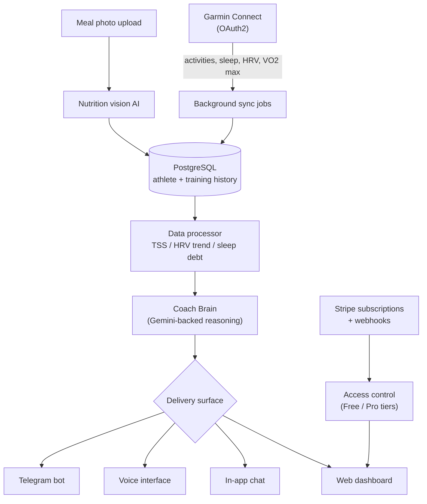

# CoachOnur AI

> An AI coaching platform for endurance athletes — syncs real training data from Garmin, reasons over sleep/HRV/training-load trends, and gives the kind of day-to-day coaching decisions a human coach would.

**Live product:** [coachonurai.com](https://www.coachonurai.com/)

**This is a documentation-only repository.** CoachOnur AI is closed-source, production software with paying subscribers, built and run by me end-to-end. The source isn't published here because it's a commercial product. This repo is an architecture write-up for recruiters and other engineers — no source code, credentials, or user data is included.

---

## The problem

I've raced multiple Ironmans and coached endurance athletes for years. The gap I kept running into with every "smart" fitness app: they show you data, but they don't reason over it the way a coach does. A coach doesn't just see "resting HR is up 5bpm" — they weigh that against three nights of bad sleep, last week's training load, and the race on the calendar, and turn it into a single decision: train hard today, or back off.

CoachOnur AI is that reasoning layer, wired directly into an athlete's real training data instead of a manual log.

## What it does

- **Pulls real data automatically** — OAuth2 connection to Garmin Connect syncs activities, sleep stages, HRV, Body Battery, and VO2 Max without the athlete lifting a finger.
- **Reasons over trends, not single data points** — combines Training Stress Score (TSS), multi-day HRV trend, and sleep debt into one coaching judgment, instead of flagging metrics in isolation.
- **Explains itself** — every recommendation comes with the reasoning behind it (e.g. *"Recovery: LOW — sleep debt + HRV suppression over 48h. Pivot to Zone 1 or rest."*), not just a score.
- **Reads meals from a photo** — nutrition vision AI extracts calories/protein/carbs/fat from a photo of a meal.
- **Meets the athlete where they are** — web dashboard, conversational chat, voice interface, and a Telegram bot all talk to the same coaching engine.
- **Runs a real subscription business** — Stripe-backed Free/Pro tiers with webhook-driven access control, not a demo toggle.

## Architecture



## Engineering decisions worth calling out

**Async end to end.** The backend is built on FastAPI's `asyncio` model specifically because the app spends most of its time waiting on external I/O — Garmin's API, Stripe, and the LLM call — not on CPU work. A blocking framework would mean every athlete's dashboard load queues behind someone else's Garmin sync.

**One coaching engine, four surfaces.** Web dashboard, chat, voice, and Telegram all route through the same reasoning layer instead of each having their own logic — so a coaching decision is consistent no matter how the athlete asks for it, and a new surface is a thin adapter, not a reimplementation.

**Trend-aware, not threshold-aware.** The easy version of this product fires an alert when a single metric crosses a fixed number. The harder, more useful version — the one actually built — looks at the trend across TSS, HRV, and sleep debt together, because any one metric in isolation is noisy enough to give bad advice.

**Self-hosted inference where it matters.** Production runs on a Raspberry Pi 5 with a Hailo-8 accelerator behind a Cloudflare Tunnel, with Supabase Postgres for durable storage — a deliberate choice to keep steady-state hosting cost low for a subscription product still growing its base, without giving up managed durability for the data that actually needs it.

**Payment state lives in webhooks, not client trust.** Subscription tier is only ever changed by a verified Stripe webhook event, never inferred from anything the client reports — the usual failure mode for hand-rolled subscription gating.

## Sample coaching output (real product behavior, illustrative data)

```
Athlete: 48h HRV trend down 12%, sleep debt 3.5h, TSS load high (last 7 days)

Recovery: LOW
Reason: Sleep debt + HRV suppression detected over 48h trend, stacked on
        an already-elevated training load this week.
Advice: Skip today's intervals. 30min Zone 1 spin or full rest.
        Re-check tomorrow — if HRV recovers, resume the block as planned.
```

## Stack

**Frontend:** React + Vite, TailwindCSS, i18next (8 languages)
**Backend:** FastAPI (Python), SQLAlchemy, PostgreSQL
**AI:** Google Gemini (coaching reasoning + nutrition vision)
**Integrations:** Garmin Connect (OAuth2), Stripe (subscriptions + webhooks), Telegram Bot API
**Infra:** Self-hosted (Raspberry Pi 5 + Hailo-8 accelerator) behind a Cloudflare Tunnel, Supabase Postgres

## What this repo is (and isn't)

- **Is:** an architecture write-up and case study, meant to show how the system is designed and why.
- **Isn't:** the source code or an install guide. CoachOnur AI is closed, proprietary software — see the live product at [coachonurai.com](https://www.coachonurai.com/).

If you're an engineer or a hiring team and want to talk through any of the design decisions above in more depth, feel free to reach out via my GitHub profile.
